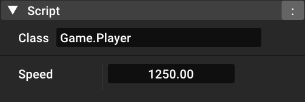

Moon Engine is a 2D game engine which currently in a development state.
Follow the progress on [Trello](https://trello.com/b/IAxK4TI0/moonengine).

## Table of Content

- [Features](#features)
- [Setup](#setup)
  - [Building The Engine](#building-the-engine)
  - [Setup Scripting](#setup-scripting)
  - [Release](#release)
- [Using The Editor](#using-the-editor)
  - [Camera](#camera)
  - [Shortcuts](#shortcuts)
- [Scripting](#scripting)
- [License](#license)

## Features

- Batch Renderer with texture layering.
- Particle System.
- Scene Serializer/Deserializer with a simple Reflection.
- Entity Component System wrapper for [entt](https://github.com/skypjack/entt).
- [Mono](https://github.com/mono/mono) C# Scripting.
- Implementation and wrapper for [Box2D](https://github.com/erincatto/box2d) physics.

## Setup

If you dont want to build the entire project and use the engine only, you can use the release build. Otherwise, you can follow the steps below to build the project with the source code.

**Requirements:** .Net Framework 4.7.2, C++ 20 and Visual Studio.
**Supported Platforms:** Windows 10-11

#### Building The Engine

<ol>
  <li>Download the repository.</li>
  <li>Run the MakeProject.bat file.</li>
  <li>Open MoonEngine2D.sln and build the solution.</li>
</ol>
  
#### Setup Scripting

<ol>
  <li>Go to "MoonEngine/MoonEditor/TemplateProject"</li>
  <li>Run the MakeProject.bat file.</li>
  <li>Open TemplateProject.sln and build the solution.</li>
</ol>

**Note:** that you can create a new solution and use "MoonEngine" features like Scene, Entity System, Renderer etc. Make sure that you link "MoonEngine" to the solution and add the necessary include directories.

#### Release

Download the latest version of MoonEngine [here](https://github.com/ImMoonBorn/MoonEngine/releases/tag/PreRelease4).

For scripting open the TemplateProject.sln located in TemplateProject folder. You can find a simple guide to use scripting in the [Scripting Seciton](#scripting).

**Note:** Do not change any directory or delete any folders and files outside of the Assets and Scripts directories.

## Using The Editor

The Editor can be used for:

- Creation and deletion of entities, adding and removing components from existing entities.
- Controlling the scene by playing, pausing, and stopping, as well as creating, saving, and loading scenes.
- Browsing through or searching for assets to use in the project.

#### Camera

- Movement: LeftShift + W/A/S/D or Middle Mouse Button.
- Zoom: Mouse wheel to zoom in/out.

#### Shortcuts

- LeftCtrl+D: Duplicate selected entity.
- Delete: Delete selected entity.
- LeftCtrl+N: New Scene.
- LeftCtrl+S: Save Scene.
- LeftCtrl+L: Load Scene.
- Gizmo: Q: Select, W: Translate, E: Scale, R: Rotate.

## Scripting

Edit, add or delete scripts in the "TemplateProject.sln".

A simple Scripting class to attach to an Entity.

```cpp
public class Player : Entity
{
    public float Speed = 1250.0f;

     void Awake()
     {
        //Gets called on entity creation.
     }

     void Update(float dt)
     {
        //Gets called on every frame update.
        //dt: Is the time difference between two frames.
     }
}
```

After making changes in the script or adding new scripts, you need to build the project (Ctrl + B) in order to apply the changes. Even if the editor is running, the script changes will be automatically applied. However, avoid building the project while in play mode, as it may result in a crash.

In the editor, select the class and edit the variables.



## License

MoonEngine is licensed under the terms of the [Apache License](http://www.apache.org/licenses/) and is available for free.
